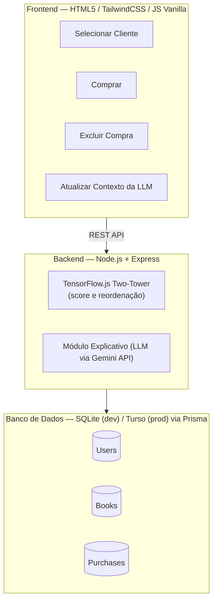
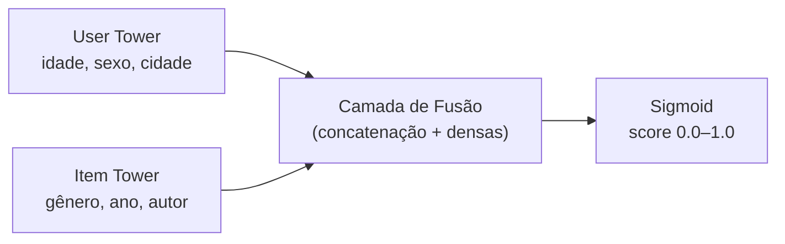

<p align="center">
  
  
  
  
  
  
</p>

# 📚 MarketPlace do Livro

> Sistema de recomendação de livros com aprendizado de máquina em tempo real e explicações em linguagem natural.

O **MarketPlace do Livro** é um e-commerce educacional que combina uma **rede neural Two-Tower** (TensorFlow.js) para calcular compatibilidade entre leitores e livros, com um **módulo de explicabilidade via LLM** (Gemini API) que traduz os scores numéricos em justificativas personalizadas em português.

Desenvolvido como projeto de portfólio, demonstra a integração end-to-end de machine learning, APIs de linguagem natural e uma interface web responsiva — tudo rodando em serviços gratuitos.

---

## ✨ Features

| Feature | Descrição |
|---|---|
| 🧠 **Recomendação por IA** | Rede neural Two-Tower que aprende padrões de compra e calcula scores de 0% a 100% de compatibilidade |
| 💬 **Explicabilidade** | LLM (via Gemini API) gera justificativas em português natural para cada recomendação |
| 🔄 **Reordenação em tempo real** | O catálogo se reorganiza automaticamente após cada compra ou exclusão |
| 🔶 **Cold Start Fallback** | Usuários sem histórico recebem recomendações baseadas em popularidade |
| 🛡️ **Resiliência** | Fallback textual automático quando a Gemini API estiver indisponível |
| 📊 **Contexto analítico** | Estatísticas agregadas da loja injetadas nos prompts para recomendações mais ricas |

---

## 🏗️ Arquitetura



### Como funciona o Two-Tower



A rede processa separadamente os dados do **usuário** (torre esquerda) e do **livro** (torre direita), concatena os vetores resultantes e calcula um score via sigmoid — representando a probabilidade de interesse do leitor naquele livro.

---

## 🛠️ Stack Tecnológica

| Camada | Tecnologia | Papel |
|---|---|---|
| **Runtime** | Node.js 20.17.0 (exato, fixado via `.nvmrc`) | Servidor backend |
| **Pacotes** | pnpm 9.x (com dependências exatas no `package.json`) | Gerenciador de pacotes reprodutíveis |
| **Framework** | Express.js (com `helmet`, `cors` e `express-rate-limit`) | API REST segura |
| **IA / ML** | `@tensorflow/tfjs` (versão exata pré-compilada) | Modelo Two-Tower (treinamento + inferência) |
| **LLM** | Gemini SDK (`@google/generative-ai`) | Explicações em linguagem natural |
| **ORM** | Prisma Client | Acesso ao banco de dados |
| **Banco (dev)** | SQLite3 | Desenvolvimento local |
| **Banco (prod)** | Turso (libSQL) | Persistência em produção via driver adapter |
| **Frontend** | HTML5 + TailwindCSS + JavaScript Vanilla | Interface do usuário (protegida contra XSS no DOM) |
| **Dataset** | Book-Crossing (subconjunto filtrado) | Seed de dados reais |
| **Deploy** | Render (backend) + Turso (banco) | Hospedagem gratuita |

---

## 📁 Estrutura do Projeto

```
marketplace-do-livro/
├── prisma/
│   ├── schema.prisma          # Modelo de dados (User, Book, Purchase)
│   ├── seed.js                # Popula o banco com o Book-Crossing Dataset
│   └── enrichGenre.js         # Enriquece livros com gênero via Open Library API
├── data/
│   ├── raw/                   # CSVs originais do Book-Crossing (não versionado)
│   ├── processed/             # Subconjunto filtrado + generos.json (cache)
│   └── model/                 # Pesos do modelo TensorFlow treinado
├── src/
│   ├── ai/
│   │   ├── encoder.js         # Normalização + One-Hot Encoding
│   │   └── recommendationModel.js  # Arquitetura Two-Tower + treino + inferência
│   ├── services/
│   │   └── llmService.js      # Integração com Gemini + cache + fallback
│   ├── routes/
│   │   ├── users.js           # GET /api/users
│   │   ├── recommendations.js # GET /api/recommendations/:userId
│   │   ├── purchases.js       # POST + DELETE /api/purchases
│   │   ├── llm.js             # POST /api/llm/refresh-context
│   │   └── model.js           # POST /api/model/train + GET /api/model/status
│   └── server.js              # Entrypoint Express com Helmet e Rate Limits
├── public/
│   ├── index.html             # Layout da aplicação
│   └── app.js                 # Lógica do frontend (estado + fetch + render seguro)
├── tests/                     # Testes automatizados (Jest/Vitest)
├── .env.example               # Template de variáveis de ambiente
├── .nvmrc                     # Versão exata do Node.js
├── .npmrc                     # Configurações do pnpm para versionamento estrito
├── .gitignore
├── package.json               # Dependências fixadas e declarativas
├── pnpm-lock.yaml             # Lockfile versionado para reprodutibilidade
└── README.md                  # ← Você está aqui
```

---

## 🚀 Setup Local

### Pré-requisitos

- [Node.js](https://nodejs.org/) na versão exata fixada em `.nvmrc` (use `nvm use` para garantir a mesma versão do time/CI — importante porque `@tensorflow/tfjs-node` compila bindings nativos e é sensível a mudanças de versão do Node)
- [pnpm](https://pnpm.io/) 9+ (via [Corepack](https://nodejs.org/api/corepack.html): `corepack enable`) — gerenciador de pacotes oficial do projeto
- Conta gratuita no [Google AI Studio](https://aistudio.google.com/) (para a chave de API Gemini)

> 💡 O projeto usa **pnpm** (não npm/yarn) com versões exatas no `package.json` e `pnpm-lock.yaml` versionado no git — isso evita reinstalações que resolvem versões diferentes de dependência entre máquinas e quebram o binding nativo do TensorFlow.js. Não delete nem ignore o lockfile.

### Instalação

```bash
# 1. Clone o repositório
git clone https://github.com/seu-usuario/marketplace-do-livro.git
cd marketplace-do-livro

# 2. Use a versão do Node fixada no .nvmrc
nvm use

# 3. Instale as dependências (respeita o pnpm-lock.yaml)
pnpm install --frozen-lockfile

# 4. Configure as variáveis de ambiente
cp .env.example .env
# Edite o .env e adicione sua GEMINI_API_KEY

# 5. Inicialize o banco de dados
pnpm exec prisma migrate dev --name init

# 6. Enriqueça os gêneros dos livros (Open Library API)
node prisma/enrichGenre.js

# 7. Popule o banco com dados do Book-Crossing
pnpm exec prisma db seed

# 8. Treine o modelo de IA
pnpm train

# 9. Inicie o servidor
pnpm dev
```

Acesse **http://localhost:3000** no navegador.

---

## ⚙️ Variáveis de Ambiente

Crie um arquivo `.env` na raiz do projeto (use `.env.example` como base):

| Variável | Descrição | Obrigatória | Default |
|---|---|---|---|
| `DATABASE_URL` | URL de conexão do banco | ✅ Sempre | `file:./dev.db` |
| `GEMINI_API_KEY` | Chave de autenticação do Gemini | ✅ Sempre | — |
| `GEMINI_MODEL` | Modelo de linguagem no Gemini | ✅ Sempre | `gemini-1.5-flash` |
| `TURSO_DATABASE_URL` | URL do banco Turso | 🔶 Produção | — |
| `TURSO_AUTH_TOKEN` | Token de autenticação Turso | 🔶 Produção | — |
| `PORT` | Porta do servidor Express | Opcional | `3000` |

> 💡 **Dica:** O modelo padrão recomendado é o `gemini-1.5-flash` por sua velocidade e gratuidade completa sem cartão de crédito no AI Studio.

---

## 📡 API REST

Todas as respostas de erro seguem o formato: `{ "error": "mensagem legível" }`.

### Endpoints

| Método | Endpoint | Descrição |
|---|---|---|
| `GET` | `/api/users` | Lista todos os clientes |
| `GET` | `/api/recommendations/:userId` | Recomendações ordenadas por score de IA |
| `POST` | `/api/purchases` | Registra uma compra (validado via Zod) |
| `DELETE` | `/api/purchases/:id` | Cancela uma compra |
| `GET` | `/api/purchases/user/:userId` | Histórico de compras de um cliente |
| `POST` | `/api/model/train` | Dispara retreino do modelo Two-Tower (rate-limited) |
| `GET` | `/api/model/status` | Status do modelo (idle/training/never_trained) |
| `POST` | `/api/llm/refresh-context` | Recalcula contexto analítico para os prompts (rate-limited) |

<details>
<summary><strong>📋 Exemplos de Request/Response</strong></summary>

#### `GET /api/recommendations/:userId` → `200 OK`

```json
{
  "userId": 3,
  "generatedAt": "2026-07-22T14:00:00.000Z",
  "usingFallback": false,
  "books": [
    {
      "bookId": 12,
      "nome": "O Nome do Vento",
      "autor": "Patrick Rothfuss",
      "ano": 2007,
      "genero": "Fantasia",
      "score": 0.87,
      "scorePercent": 87,
      "isPurchased": false,
      "justificativa": "Como você costuma ler fantasia, este título tem grande chance de agradar."
    }
  ]
}
```

#### `POST /api/purchases` → `201 Created`

```json
// Request body
{ "userId": 3, "bookId": 12 }

// Response
{ "id": 45, "userId": 3, "bookId": 12, "createdAt": "2026-07-22T14:05:00.000Z" }
```

#### `GET /api/model/status` → `200 OK`

```json
{
  "status": "idle",
  "lastTrainedAt": "2026-07-22T14:12:03.000Z",
  "metrics": { "loss": 0.21, "valLoss": 0.29, "epochs": 18 }
}
```

#### `POST /api/llm/refresh-context` → `200 OK`

```json
{
  "updatedAt": "2026-07-22T14:15:00.000Z",
  "context": {
    "generoMaisPopular": "Fantasia",
    "faixaEtariaPredominante": "25-34",
    "autorMaisLido": "J.K. Rowling"
  }
}
```

</details>

---

## 🧠 Modelo de IA — Two-Tower Network

### Arquitetura

| Componente | Entrada | Camadas | Saída |
|---|---|---|---|
| **User Tower** | `userEmbedding(16)` + `idade_norm` + `sexo_onehot(3)` + `cidade_onehot(N+1)` | Dense(32, relu) → Dense(16, relu) | vetor (16) |
| **Item Tower** | `bookEmbedding(16)` + `ano_norm` + `genero_onehot(8)` | Dense(32, relu) → Dense(16, relu) | vetor (16) |
| **Fusão** | concat(user, item) = (32) | Dense(16, relu) → Dense(1, sigmoid) | score 0.0–1.0 |

### Hiperparâmetros

| Parâmetro | Valor |
|---|---|
| Negative sampling ratio | 1:4 (positivo:negativo) |
| Split treino/validação | 80% / 20% |
| Batch size | 32 |
| Épocas máximas | 30 |
| Early stopping | patience = 3 (val_loss) |
| Otimizador | Adam (lr = 0.001) |
| Loss | Binary Crossentropy |

### Quando o treinamento roda

- **No boot do servidor**, se não houver modelo salvo (ou em produção, onde o disco é efêmero)
- **Sob demanda**, via `POST /api/model/train`
- **Nunca** a cada compra individual — compras disparam apenas re-inferência

---

## 📊 Dataset

O projeto usa o **Book-Crossing Dataset**, filtrado para um subconjunto denso:

- **~300–400 livros** com pelo menos 15 avaliações
- **~200–300 usuários** que avaliaram pelo menos 5 desses livros
- Toda avaliação (explícita ou implícita) tratada como **sinal positivo de interação** (feedback implícito)
- Gêneros enriquecidos via **Open Library API** e mapeados para categorias em português

---

## 📋 Roadmap de Desenvolvimento

O projeto está dividido em **6 fases sequenciais**, pensadas para execução incremental:

| Fase | Descrição | Status |
|---|---|---|
| **Fase 1** | Estrutura base, dados e banco de dados (SQLite + Prisma) | 🔲 Pendente |
| **Fase 2** | Engine de IA com TensorFlow.js (Two-Tower Network) | 🔲 Pendente |
| **Fase 3** | Backend & integração com LLM (Express API) | 🔲 Pendente |
| **Fase 4** | Interface do usuário (Frontend Web) | 🔲 Pendente |
| **Fase 5** | Testes de ciclo fechado e validação | 🔲 Pendente |
| **Fase 6** | Deploy e publicação (Render + Turso) | 🔲 Pendente |

> Para detalhes de cada fase, consulte o [PRD](docs/PRD_Market_Place_do_Livro.md) e o [SPEC técnico](docs/SPEC_MarketPlace_do_Livro.md).

---

## ⚠️ Limitações Conhecidas

| Limitação | Mitigação |
|---|---|
| **Dataset esparso / cold start** | Fallback de popularidade para usuários sem histórico |
| **Two-Tower com poucos dados** | Modelo pode não generalizar tão bem quanto em produção real — esperado e documentado para fins didáticos |
| **Limites de taxa do Gemini** | Cache de justificativas + fallback textual automático |
| **Cold start do Render** | Primeira requisição após inatividade leva ~30–60s — **não é um bug**, é o free tier "acordando" |
| **Enriquecimento de gênero incompleto** | Nem todo ISBN retorna subjects na Open Library — fallback "Não classificado" |

---

## 🤝 Contribuição

Este é um projeto educacional de portfólio. Contribuições, sugestões e feedback são bem-vindos! Abra uma [issue](../../issues) ou envie um [pull request](../../pulls).

---

## 📄 Licença

Este projeto está licenciado sob a [Licença MIT](LICENSE).

---

<p align="center">
  Feito com ☕ e 🤖 — <strong>MarketPlace do Livro</strong>
</p>

## 🤝 Conecte-se comigo

- **LinkedIn:** [Renato Andrade](www.linkedin.com/in/renato-andrade-a79570299)
- **DIO:** [Renato Andrade](https://web.dio.me/users/renatoandrade00)
