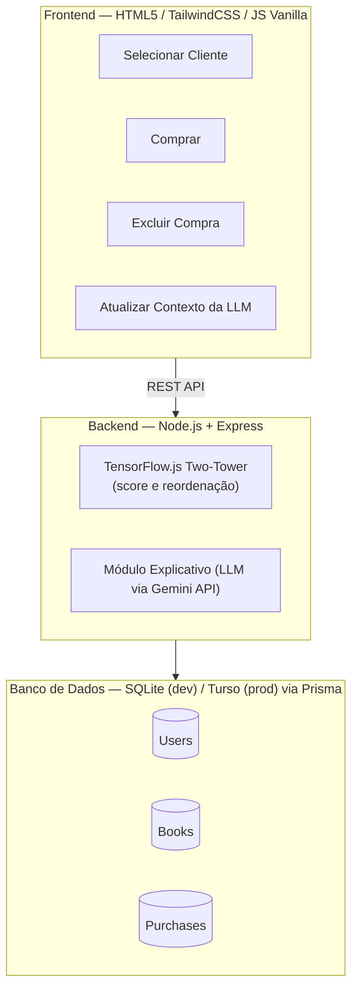
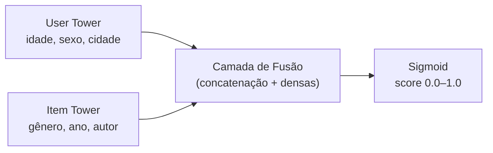

# Product Requirement Document (PRD) — MarketPlace do Livro

## 1. Identificação do Projeto
* **Nome do Projeto:** MarketPlace do Livro
* **Objetivo:** Criar um sistema e-commerce de recomendação de livros com aprendizado de máquina em tempo real e explicações em linguagem natural, como projeto educacional e peça de portfólio.
* **Escopo:** Acadêmico / Educacional / Portfólio (GitHub)
* **Stack Principal:** Node.js (ES6+), `@tensorflow/tfjs-node`, SQLite (dev) + Turso/libSQL (produção) via Prisma ORM, HTML5 / TailwindCSS / JavaScript Vanilla
* **Ferramenta de desenvolvimento assistido:** Google Antigravity (IDE agente)

---

## 2. Visão Geral & Arquitetura

O **MarketPlace do Livro** combina duas abordagens de Inteligência Artificial:

1. **Engine de Recomendação Numérica:** Modelo TensorFlow.js de duas torres (*Two-Tower Neural Network*) que calcula a probabilidade de interesse/compra ($0.0$ a $1.0$) com base no perfil demográfico do cliente e no catálogo de livros.
2. **Explicabilidade via LLM:** Módulo generativo que traduz as métricas do TensorFlow em justificativas persuasivas e personalizadas em português.

### Diagrama de Arquitetura



### Fluxo simplificado do Two-Tower



---

## 3. Decisões de Arquitetura Definidas

Estas decisões foram fechadas antes do detalhamento das fases, para evitar ambiguidade durante a execução no Antigravity:

| Decisão | Escolha | Motivo |
|---|---|---|
| **API de LLM** | **Gemini API** (Google AI Studio) | Cadastro sem cartão de crédito, tier gratuito generoso (15 RPM) e excelente qualidade textual para português. Modelo padrão: `gemini-1.5-flash` (rápido, gratuito, sem exigência de cartão de crédito no AI Studio). |
| **Fonte de dados (seed)** | **Book-Crossing Dataset** (subconjunto filtrado) | Dataset real e amplamente usado em sistemas de recomendação, com dados demográficos de usuário (idade, localização) que já combinam com o schema `User` proposto. |
| **Deploy** | **Render** (backend/API) + **Turso** (banco persistente via driver adapter libSQL do Prisma) | Render é o único dos PaaS "populares" com tier gratuito sem cartão de crédito; porém seu disco é efêmero, então o SQLite local não sobrevive a reinícios — o Turso resolve isso mantendo compatibilidade total com Prisma e com o dialeto SQLite. |
| **Proteção de rotas administrativas** | `express-rate-limit` em `POST /api/model/train` e `POST /api/llm/refresh-context`, opcionalmente reforçado por um header simples `x-admin-token` comparado a uma env var (`ADMIN_TOKEN`) | O projeto não tem autenticação (decisão de escopo, ver Seção 4 e SPEC seção 10) — sem isso, qualquer pessoa que encontre a URL do Render pode disparar retreino (operação cara de CPU) em loop ou estourar a cota diária gratuita do Gemini. Rate-limit resolve os dois riscos sem exigir um sistema de auth completo, fora de escopo aqui. |

> ⚠️ **Nota sobre o Gemini:** o tier gratuito tem limites de taxa (15 requisições/min e 1.500 requisições/dia). Para uma demo de portfólio isso é suficiente, mas o `llmService.js` deve ter um *fallback* textual simples (ex.: template com os dados do livro) caso a API retorne erro 429 ou cota estourada, para a UI nunca quebrar.

> ⚠️ **Nota sobre o Render free tier:** o serviço "dorme" após um período de inatividade e leva ~30–60s para responder à primeira requisição seguinte. Isso é esperado — documente no README para quem for testar a demo, para não parecer um bug.

---

## 4. Estrutura Modular para Execução (Antigravity-Friendly)

Para otimizar o uso do agente do **Antigravity** e manter o contexto de cada sessão limpo e focado, o desenvolvimento é dividido em **6 fases sequenciais**, cada uma pensada para caber em uma única sessão/tarefa do agente. Recomenda-se rodar uma fase por vez e revisar o "Plan Artifact" gerado pelo agente antes de aprovar a execução.

---

### FASE 1: Estrutura Base, Dados e Banco de Dados (SQLite + Prisma)

* **Step 1.1: Inicialização do Projeto**
  * Criar a estrutura de pastas (ver seção 5).
  * Gerenciador de pacotes: **pnpm** (não npm/yarn), habilitado via Corepack (`corepack enable`). Declarar `"packageManager": "pnpm@9.x.x"` no `package.json` para fixar a versão do próprio pnpm entre máquinas.
  * Configurar o `package.json` com as dependências essenciais: `express`, `@prisma/client`, `prisma`, `@tensorflow/tfjs`, `csv-parser`, `dotenv`, `@google/generative-ai`, `zod` (validação de entrada), `helmet`, `cors`, `express-rate-limit`. **Todas as versões devem ser exatas** (sem `^`/`~`) — importante para garantir reprodutibilidade.
  * Criar `.npmrc` (`save-exact=true`, `engine-strict=true`) e `.nvmrc` com a versão exata do Node (ex. `20.17.0`), refletida também no campo `engines` do `package.json`.
  * Criar `.env.example` (sem valores reais) e `.gitignore` (incluindo `.env`, `node_modules`, `*.db`, `data/raw/*.zip`). O `pnpm-lock.yaml`, ao contrário do `.env`, **deve ser versionado** — ele é o que garante instalações reprodutíveis entre sua máquina, o Antigravity e o deploy no Render.

* **Step 1.2: Modelagem do Banco de Dados (`schema.prisma`)**
  * `User`: `id`, `nome`, `idade`, `sexo`, `pais`, `cidade`.
  * `Book`: `id`, `isbn` (opcional, útil para rastrear a origem no Book-Crossing), `nome`, `autor`, `ano`, `genero`.
  * `Purchase`: `id`, `userId` (FK), `bookId` (FK), `createdAt`.
  * Configurar o datasource para usar SQLite local (`file:./dev.db`) em desenvolvimento — a troca para Turso acontece só na Fase 6 (deploy), via driver adapter, sem mudar o schema.

* **Step 1.3: Obtenção e Filtragem do Book-Crossing Dataset**
  * Baixar o `BX-CSV-Dump.zip` (mirror recomendado: dataset "Book-Crossing" no Kaggle, ou o pacote oficial do GroupLens) e salvar os CSVs brutos em `/data/raw`. O dataset original tem ~278 mil usuários, ~271 mil livros e ~1,1 milhão de avaliações — grande demais para treinar localmente, então o script de seed deve **filtrar um subconjunto denso**:
    1. Selecionar os livros com pelo menos ~15 avaliações registradas.
    2. Dentre esses, pegar os ~300–400 mais avaliados.
    3. Selecionar usuários que avaliaram pelo menos 5 desses livros, limitando a ~200–300 usuários (os mais ativos).
    4. Tratar **toda** avaliação do Book-Crossing (explícita ou implícita, ou seja nota 0) como um sinal positivo de interação e gravá-la como um registro de `Purchase` — essa é a abordagem padrão em sistemas de recomendação com *feedback implícito* e evita ter que decidir um limiar arbitrário de nota.
  * Esses números são um ponto de partida seguro para treinar rápido em CPU local; ajuste conforme o desempenho observado.

* **Step 1.4: Enriquecimento de Gênero (Open Library API)**
  * O Book-Crossing **não** tem coluna de gênero. Criar um script (`prisma/enrichGenre.js`) que, para cada livro selecionado, consulta a Open Library API (`https://openlibrary.org/api/books?bibkeys=ISBN:<isbn>&format=json&jscmd=data`, gratuita e sem chave) e extrai o primeiro "subject" retornado como gênero aproximado.
  * Mapear os subjects mais comuns para um conjunto pequeno e fixo de gêneros em português (ex.: Ficção, Romance, Fantasia, Biografia, Infantojuvenil, Não-ficção), com fallback **"Não classificado"** para livros sem correspondência.
  * Cachear as respostas em `/data/processed/generos.json` para não repetir chamadas a cada execução do seed.

* **Step 1.5: Script de Seed (`prisma/seed.js`)**
  * Ler os CSVs filtrados + o cache de gêneros e popular `User`, `Book` e `Purchase` via Prisma Client.

---

### FASE 2: Engine de IA com TensorFlow.js (Two-Tower Network)

* **Step 2.1: Módulo de Pré-processamento e Codificação**
  * Criar `src/ai/encoder.js` para normalizar dados numéricos (idade, ano) e converter variáveis categóricas (sexo, cidade, gênero) via *One-Hot Encoding*.

* **Step 2.2: Construção da Arquitetura Two-Tower**
  * Criar `src/ai/recommendationModel.js`.
  * **User Tower:** processa `userId`, `idade`, `sexo`, `cidade`.
  * **Item Tower:** processa `bookId`, `genero`, `ano`.
  * **Camada Superior:** concatenação das duas torres + camadas densas com ativação `sigmoid` para o score final ($0.0$–$1.0$).

* **Step 2.3: Pipeline de Treinamento e Inferência**
  * **Exemplos positivos:** todo par (usuário, livro) presente em `Purchase`.
  * **Exemplos negativos (obrigatório):** amostragem aleatória de pares (usuário, livro) *sem* registro de compra, numa proporção sugerida de 1:2 ou 1:4 (positivo:negativo). Sem exemplos negativos, o modelo aprende uma solução trivial (score sempre alto) e não serve pra nada — esse passo não estava explícito no rascunho original e é essencial.
  * Dividir treino/validação (ex.: 80/20), treinar e **persistir os pesos** em disco (`model.save('file://./data/model')`), para que o servidor não precise retreinar a cada boot.
  * **Inferência (tempo real):** a rota de recomendações apenas carrega o modelo salvo e roda `model.predict()` — rápido, adequado a cada requisição.
  * **Retreino (ação separada, não automática a cada compra):** um script `npm run train` ou uma rota administrativa dedicada, que recalcula os pesos usando todo o histórico atualizado de `Purchase`. Rodar sob demanda (botão/admin) ou periodicamente — nunca a cada compra individual, pois retreinar é uma operação cara.
  * **Fallback para "cold start":** usuários novos (sem nenhuma compra) ou livros novos (sem histórico) tendem a receber scores pouco confiáveis do Two-Tower puro. Implementar um fallback simples baseado em popularidade (ex.: livros com mais compras registradas) para esses casos, em vez de exibir um score aleatório.

---

### FASE 3: Backend & Integração com LLM (Express API)

* **Step 3.1: Rotas da API REST**
  * `GET /api/users` — lista de clientes para o dropdown.
  * `GET /api/recommendations/:userId` — roda a inferência do Two-Tower (já treinado) e retorna os livros ordenados por score, com fallback de popularidade para cold start.
  * `POST /api/purchases` — registra uma compra e dispara apenas a **re-inferência** (não retreino) para atualizar os scores exibidos.
  * `DELETE /api/purchases/:id` — cancela uma compra e atualiza os scores da mesma forma.
  * `POST /api/model/train` — (nova) dispara o retreino completo do modelo TensorFlow, de forma assíncrona/administrativa.

* **Step 3.2: Módulo de Explicabilidade (LLM Service)**
  * Criar `src/services/llmService.js` usando o SDK da Gemini API (`@google/generative-ai`).
  * Prompt dinâmico combinando: perfil do leitor + atributos do livro + score do Two-Tower (em %) + contexto analítico agregado (ver Step 3.3) → justificativa curta e amigável em português.
  * Implementar *fallback* textual simples (template sem LLM) para quando a Gemini API falhar ou estourar o limite de requisições.

* **Step 3.3: Endpoint de Atualização de Contexto Analítico da LLM**
  * `POST /api/llm/refresh-context` — **não é treinamento/fine-tuning do modelo de linguagem.** O que esse endpoint faz é recalcular estatísticas agregadas do banco (gêneros mais vendidos, faixa etária predominante, autores mais lidos etc.) e guardá-las para serem injetadas como contexto extra nos prompts seguintes — uma recalibração de contexto, não um retreino de LLM. Nomear e documentar isso com clareza evita que o agente do Antigravity (ou outro dev) tente implementar fine-tuning de verdade, o que seria caro e desnecessário aqui.

---

### FASE 4: Interface do Usuário (Frontend Web)

* **Step 4.1: Layout Base e Componentes**
  * Topbar com dropdown de cliente.
  * Botão **"Atualizar Contexto"** (renomeado de "Treinar LLM", ver Step 3.3).
  * Estados de carregamento e mensagens de erro visíveis (especialmente relevantes dado o *fallback* do Gemini e o "acordar" do Render).

* **Step 4.2: Grid Dinâmico de Livros**
  * Título, Autor, Ano, Gênero.
  * **Badge de Porcentagem de Interesse (%)** do TensorFlow.js.
  * **Texto de Justificativa da LLM**.
  * Botão **"Comprar"**.
  * *(Opcional, sugestão de UX)*: indicar visualmente livros já comprados pelo cliente selecionado, já que o catálogo reordena mas continua mostrando todos os livros.

* **Step 4.3: Painel de Histórico de Compras**
  * Lista de compras ativas do cliente, com botão **"Excluir Compra"**.

---

### FASE 5: Testes de Ciclo Fechado e Validação

* **Step 5.1: Teste de Reordenação Dinâmica**
  * Selecionar cliente → Comprar um livro → validar que o catálogo foi reordenado (via re-inferência, não retreino).

* **Step 5.2: Teste do Botão Excluir**
  * Remover uma compra → confirmar exclusão no banco e reajuste das porcentagens.

* **Step 5.3 (opcional, recomendado para portfólio): Testes Automatizados**
  * Suíte básica com Jest ou Vitest cobrindo: `encoder.js` (transformações determinísticas), as rotas da API (com um banco de teste isolado) e o *fallback* do `llmService.js`. Não é obrigatório para o funcionamento do projeto, mas agrega bastante credibilidade técnica numa avaliação de portfólio.

---

### FASE 6: Deploy e Publicação (Render + Turso)

* **Step 6.1: Configurar o Turso**
  * Criar conta gratuita em turso.tech, instalar a CLI (`turso auth login`) e criar o banco (`turso db create marketplace-livro`).
  * Instalar `@libsql/client` e `@prisma/adapter-libsql`.
  * Manter o SQLite local (`file:./dev.db`) para desenvolvimento e usar o driver adapter do libSQL apenas em produção, alternando por variável de ambiente.
  * **Atenção:** `prisma migrate dev` / `prisma db push` exigem uma conexão local — gere as migrations localmente contra o SQLite e aplique-as no Turso via CLI. Documentar esse fluxo no README para não travar o deploy.

* **Step 6.2: Deploy do Backend no Render**
  * Criar um *Web Service* gratuito conectado ao repositório GitHub.
  * Configurar as variáveis de ambiente no painel do Render: `GEMINI_API_KEY`, `TURSO_DATABASE_URL`, `TURSO_AUTH_TOKEN`.
  * Build command: `npm install && npx prisma generate`. Start command: apontar para o entrypoint do servidor Express.

* **Step 6.3: Frontend**
  * Servir o frontend estático pelo próprio Express (mesma origem do backend) — evita configurar CORS e mantém o deploy em um único serviço gratuito.

* **Step 6.4: Documentação da Demo**
  * Registrar no README o link da demo, um GIF/vídeo curto do fluxo de reordenação e o aviso sobre o "cold start" do Render free tier.

---

## 5. Estrutura de Pastas Sugerida

```
marketplace-do-livro/
├── prisma/
│   ├── schema.prisma
│   ├── seed.js
│   └── enrichGenre.js
├── data/
│   ├── raw/              # CSVs originais do Book-Crossing (não versionar no git)
│   └── processed/        # subconjunto filtrado + generos.json (cache)
├── src/
│   ├── ai/
│   │   ├── encoder.js
│   │   └── recommendationModel.js
│   ├── services/
│   │   └── llmService.js
│   ├── routes/
│   │   ├── users.js
│   │   ├── recommendations.js
│   │   ├── purchases.js
│   │   ├── llm.js
│   │   └── model.js
│   └── server.js
├── public/
│   ├── index.html
│   └── app.js
├── .env.example
├── .gitignore
├── package.json
└── README.md
```

---

## 6. Requisitos do Sistema e Ambiente
* **Node.js:** versão exata fixada em `.nvmrc` e no campo `engines` do `package.json` (ex. `20.17.0`) — não uma faixa aberta, para não quebrar o binding nativo do `@tensorflow/tfjs-node` entre máquinas diferentes
* **Gerenciador de pacotes:** pnpm 9+ (via Corepack), com `pnpm-lock.yaml` versionado e todas as dependências fixadas em versão exata (sem `^`/`~`) no `package.json`
* **Banco de Dados:** SQLite3 (dev) / Turso — libSQL (produção)
* **Contas gratuitas necessárias:** Google AI Studio (chave de API Gemini), Turso, Render (para deploy)
* **Variáveis de ambiente (`.env`):** `DATABASE_URL`, `GEMINI_API_KEY`, `GEMINI_MODEL`, `TURSO_DATABASE_URL`, `TURSO_AUTH_TOKEN`, `PORT` — todas validadas no boot do servidor (`server.js` deve encerrar com erro claro se alguma obrigatória estiver ausente, em vez de falhar silenciosamente na primeira chamada que a usar)

---

## 7. Riscos e Limitações Conhecidas
* **Dataset esparso / cold start:** mesmo após a filtragem, a densidade de interações é baixa — mitigado com o fallback de popularidade (Step 2.3).
* **Two-Tower com poucos dados:** o modelo pode não generalizar tão bem quanto em produção real; isso é esperado e aceitável para fins didáticos — vale deixar isso explícito no README como uma limitação conhecida, não escondida.
* **Limites de taxa do Gemini:** uso intenso da demo pode esbarrar no tier gratuito — mitigado com cache de justificativas já geradas e fallback textual.
* **Cold start de infraestrutura (Render):** primeira requisição após inatividade demora ~30–60s.
* **Enriquecimento de gênero incompleto:** nem todo ISBN retorna "subjects" na Open Library — fallback "Não classificado" é esperado para uma parcela dos livros.
* **Abuso de rotas públicas sem autenticação:** como o projeto não implementa login (decisão de escopo), qualquer pessoa que descubra a URL pública no Render pode chamar `POST /api/model/train` (operação cara de CPU) ou `POST /api/llm/refresh-context` repetidamente — mitigado com `express-rate-limit` nessas rotas e, opcionalmente, um token administrativo simples (ver Seção 3 e SPEC seção 4.4.1).

---

## 8. Checklist de Portfólio (GitHub)
* `README.md` com: descrição do projeto, arquitetura, passo a passo de setup local, variáveis de ambiente necessárias, link da demo (se aplicável) e GIF/vídeo do fluxo.
* `.env.example` com todas as chaves necessárias, sem valores reais.
* `.gitignore` cobrindo `.env`, `node_modules`, `*.db`, `data/raw/*`.
* `LICENSE` — sugestão: MIT (padrão comum para projetos de portfólio).

---

## 9. Recomendações de Uso no Antigravity
* Anexar este PRD como contexto do projeto e executar **uma fase por vez**, deixando o agente gerar o "Plan Artifact" da fase antes de aprovar a execução.
* Revisar/ajustar o plano gerado pelo agente antes de rodar — principalmente nas Fases 1 e 2, onde as decisões de filtragem de dados e negative sampling afetam diretamente a qualidade do modelo.
* Encerrar a sessão ao final de cada fase concluída para manter o contexto do agente limpo e focado, como já era a intenção original deste documento.
