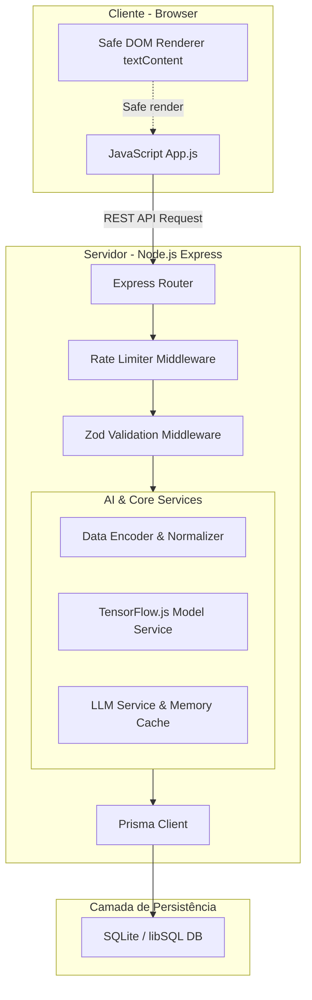
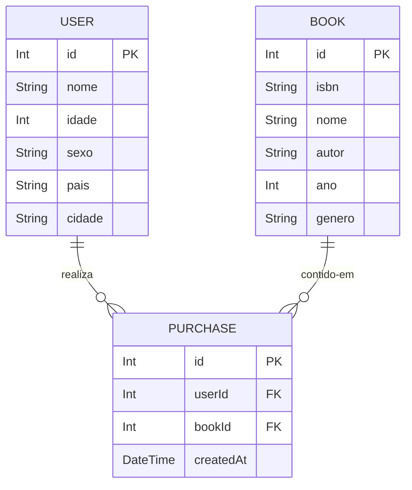
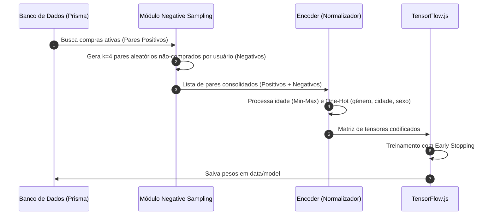

# Software Design Document (SDD) — MarketPlace do Livro

Este documento descreve as especificações técnicas, padrões de arquitetura, fluxos de dados e segurança do sistema **MarketPlace do Livro**. Ele serve como guia de engenharia detalhado para a implementação e evolução do projeto.

---

## 1. Visão Geral do Sistema

O **MarketPlace do Livro** é uma aplicação web de comércio eletrônico didática com foco em inteligência artificial híbrida de duas frentes:
1. Um **motor de recomendação numérica** baseado em aprendizado profundo (Deep Learning) com rede neural Two-Tower rodando localmente no Node.js via TensorFlow.js.
2. Um **sistema de explicabilidade cognitiva** baseado em LLM via Gemini API que converte o percentual de afinidade em uma frase persuasiva personalizada em português de fácil compreensão.

---

## 2. Arquitetura do Sistema e Topologia

O sistema é construído como um monólito modular de camada única no backend, servindo recursos estáticos no frontend para simplificar a infraestrutura.

### Diagrama de Blocos de Componentes

---

## 3. Lógica de Dados & Persistência

O banco de dados utiliza a biblioteca libSQL (via SQLite local no ambiente de desenvolvimento e Turso na produção). O mapeamento objeto-relacional (ORM) é gerenciado pelo **Prisma**.

### Modelo de Dados Lógico (ERD)

### Regras de Negócio Associadas ao Schema:
* **Integridade Referencial:** A relação entre `User`/`Book` e `Purchase` possui restrição de chave estrangeira com deleção em cascata desativada por padrão para segurança de histórico.
* **Restrição de Unicidade:** O índice `@@unique([userId, bookId])` impede a duplicidade de compras de um mesmo livro por um usuário. Isso mantém a pureza dos dados de engajamento positivo para o TensorFlow.js.
* **Proibição de SQL Dinâmico:** Para evitar vulnerabilidades de injeção SQL, consultas customizadas devem ser restritas ao `$queryRaw` nativo parametrizado do Prisma, proibindo `$queryRawUnsafe`.

---

## 4. Pipeline da Rede Neural Two-Tower

A recomendação numérica é impulsionada por uma rede neural de duas torres, concebida para mapear dados esparsos de usuários e livros em um espaço de embedding compartilhado de baixa dimensão.

### Fluxo de Dados de Treinamento e Negativos

### Arquitetura de Camadas TensorFlow.js

1. **User Tower:**
   * Input 1: `userId` (Embedding de dimensão 16)
   * Input 2: Características demográficas normalizadas (`idade_norm` [1], `sexo_onehot` [3], `cidade_onehot` [N+1])
   * Processamento: Concatenação dos inputs seguida de duas camadas densas lineares de 32 e 16 neurônios com ativação ReLU.
2. **Item Tower (Book):**
   * Input 1: `bookId` (Embedding de dimensão 16)
   * Input 2: Características literárias normalizadas (`ano_norm` [1], `genero_onehot` [M+1])
   * Processamento: Concatenação dos inputs seguida de duas camadas densas lineares de 32 e 16 neurônios com ativação ReLU.
3. **Upper Fusion Layer:**
   * Operação: Concatenação do vetor de saída do User Tower (16) com o vetor do Item Tower (16).
   * Processamento: Camada Densa com 16 neurônios (ReLU) finalizando com uma camada de saída de 1 neurônio e ativação Sigmoid ($[0.0, 1.0]$).

---

## 5. Módulo LLM & Explicabilidade

O serviço de explicabilidade em linguagem natural consome as métricas de inferência da IA e as formata em justificativas de marketing e persuasão personalizadas.

### Prompt Dinâmico e Sanitização

O prompt é composto por dados estáticos do sistema combinados com dados contextuais da requisição:
1. **Instruções de Sistema (System Prompt):** Impõe o papel de consultor de e-commerce, delimita a resposta a no máximo duas frases em português, e impede alucinações (inventar características literárias ou demográficas).
2. **Dados Dinâmicos de Entrada (User Prompt):** Dados demográficos do usuário + metadados do livro recomendado + o percentual de afinidade retornado pela rede Two-Tower ($score \times 100$).
3. **Contexto Analítico da Loja:** Gênero predominante, autor mais lido e métricas agregadas geradas sob demanda pelo endpoint `/api/llm/refresh-context`.

### Prevenção contra Injeção de Prompt (Prompt Injection)
Strings vindas do dataset de terceiros (como `nome` do livro, `autor` ou `cidade` do leitor) sofrem sanitização prévia removendo quebras de linha (`\n` e `\r`) e caracteres especiais de controle. Isso impede a quebra do fluxo lógico estruturado que poderia subverter as instruções de segurança do prompt do sistema.

### Estratégia de Caching e Fallbacks
* **Cache em Memória:** Um cache simples por mapa no backend armazena justificativas agregando a chave por `` `${userId}-${bookId}-${Math.round(score * 20)}` ``. Isso reduz custos de API e previne o consumo redundante.
* **Fallback Estático:** Se a Gemini API responder com status `429` (limite de taxa do tier gratuito) ou sofrer instabilidade de rede, o sistema de forma transparente injeta um fallback textual padrão formatado localmente, mitigando falhas na experiência do usuário.

---

## 6. Mecanismos de Segurança e Defesa

Como o sistema é público e não possui autenticação tradicional, a segurança das rotas críticas é reforçada na borda do servidor Express:

| Vetor de Risco | Componente de Defesa | Implementação Técnica |
|---|---|---|
| **Ataque DoS no Treinamento** | Concorrência Mutex + Rate Limit | Flag `isTraining` responde `409 Conflict` se houver treino em andamento. `express-rate-limit` limita requisições administrativas para 1 por minuto por IP. |
| **Vazamento de Recursos API LLM** | Autenticação por Token Administrativo | A rota `/api/llm/refresh-context` e `/api/model/train` validam o header `x-admin-token` contra a variável `ADMIN_TOKEN`. |
| **Ataque XSS no Frontend** | Renderização Segura do DOM | Uso obrigatório de `textContent` no arquivo `public/app.js` ao injetar justificativas da LLM e dados do dataset. Helmet configurado para gerenciar políticas de CSP (Content Security Policy). |
| **Injeção de Parâmetros** | Validação Estrita de Entrada | Middleware Zod valida e força coerção de tipos nos bodies e parâmetros numéricos de rotas (ex: userId e bookId). |
